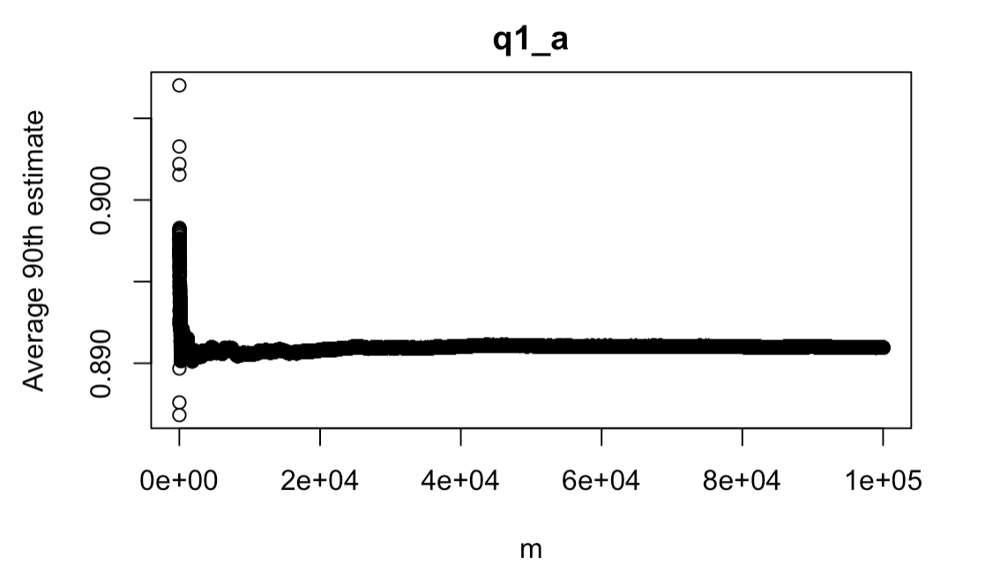
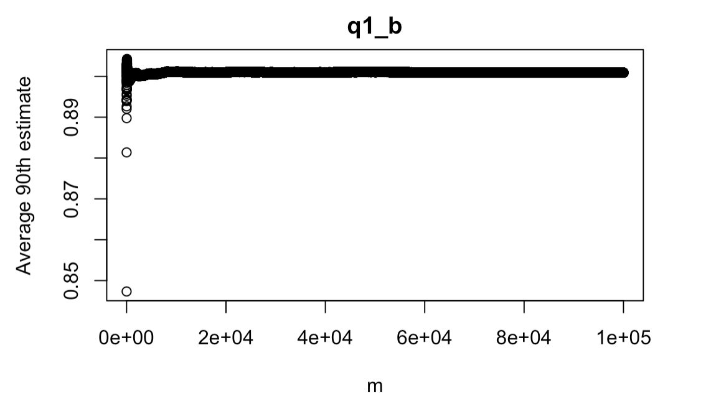
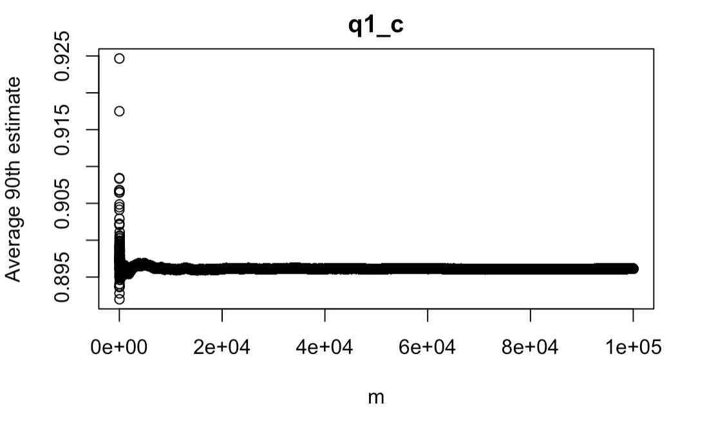
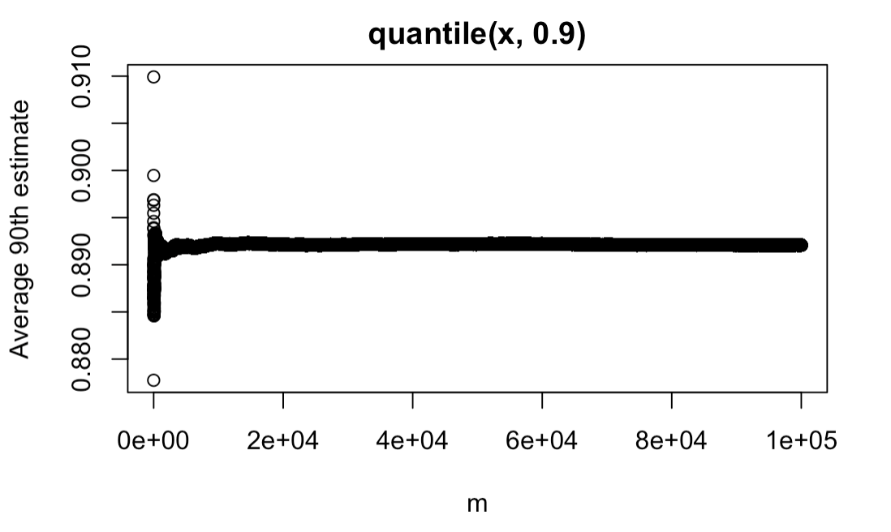
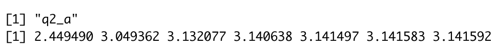
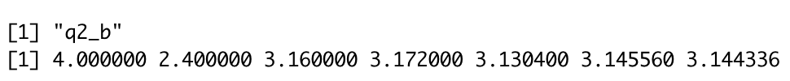
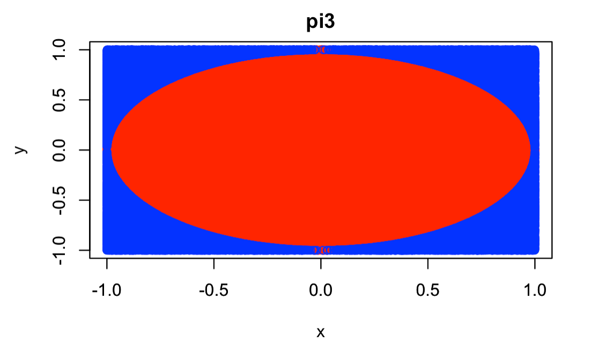

```{r setup, include=FALSE}
knitr::opts_chunk$set()
```

# Answers

## Question 1

{width="200"} {width="200"} {width="200"} {width="200"}

q1_e: The ultimate sample mean for each of the four estimates are about 0.89, 0.9, 0.895, and 0.89 respectively.The second is the best, since the distribution should be uniform, and according to the formula which calculate the 90% quantile between 0 to 1, 0.9 should be the answer.

## Question 2

{width="400" height="36"} {width="400" height="36"}

{width="350"}

# Supporting Codes

## Question 1: 90th Percentile

Assessing estimates of the 90th percentile of 100 iid uniform(0,1) random variables. The R function quantile() implements a somewhat complex interpolation method in order to estimate a particular quantile, such as the 90th percentile. We will compare the estimate in quantile() with simpler estimates.

### a. Write a function that takes as input a vector of length 100 and outputs the 90th of the 100 values sorted from smallest to largest. Note that the input vector might not be sorted

```{r, eval=FALSE}
q1_a<-function(x){
  sorted <- sort(x, decreasing = FALSE)
  sorted[90]
}
```

### b. Write a function to find the 91st of the sorted vector of 100 values.

```{r, eval=FALSE}
q1_b <- function(x){
  sorted <- sort(x, decreasing = FALSE)
  sorted[91]
}
```

### c. Write a function that outputs the average of the 90th and 91st of the sorted vector of 100 values.

```{r, eval=FALSE}
q1_c <- function(x){
  sorted <- sort(x, decreasing = FALSE)
  (sorted[90] + sorted[91]) / 2
}
```

### d. For each of your functions in parts a-c, as well as the function quantile(x,0.9), do the following:

i.  Generate 100 iid uniform (0,1) random variables, and calculate your estimate of the 90th percentile.
ii. Repeat step (i) 100,000 times.
iii. Plot the sample mean of the first m of your estimates, as a function of m.

```{r, eval=FALSE}
#q1_a
m <- 100000
l <- 100000
estimate_vector <- vector(length = l)
#get 100000 estimate as a vector
for (i in 1:l) {
  test_vector <- runif(100, min = 0, max = 1)
  estimate_vector[i] <- q1_a(test_vector)
}

avg_estimate <-vector(length = m)
for (i in 1:m){
  current_avg <- sum(estimate_vector[1:i]) / i
  avg_estimate[i] <- current_avg
}
 
n <- 1:m
plot(n, avg_estimate, ylab = 'Average 90th estimate', xlab = 'm')
title("q1_a")

```

```{r, eval=FALSE}
#q1_b
m <- 100000
l <- 100000
estimate_vector <- vector(length = l)
#get 100000 estimate as a vector
for (i in 1:l) {
  test_vector <- runif(100, min = 0, max = 1)
  estimate_vector[i] <- q1_b(test_vector)
}

avg_estimate <-vector(length = m)
for (i in 1:m){
  current_avg <- sum(estimate_vector[1:i]) / i
  avg_estimate[i] <- current_avg
}
 
n <- 1:m
plot(n, avg_estimate, ylab = 'Average 90th estimate', xlab = 'm')
title("q1_b")
```

```{r, eval=FALSE}
#q1_c
m <- 100000
l <- 100000
estimate_vector <- vector(length = l)
#get 100000 estimate as a vector
for (i in 1:l) {
  test_vector <- runif(100, min = 0, max = 1)
  estimate_vector[i] <- q1_c(test_vector)
}

avg_estimate <-vector(length = m)
for (i in 1:m){
  current_avg <- sum(estimate_vector[1:i]) / i
  avg_estimate[i] <- current_avg
}
 
n <- 1:m
plot(n, avg_estimate, ylab = 'Average 90th estimate', xlab = 'm')
title("q1_c")
```

```{r, eval=FALSE}
#quantile(x, 0.9)
m <- 100000
l <- 100000
estimate_vector <- vector(length = l)
#get 100000 estimate as a vector
for (i in 1:l) {
  test_vector <- runif(100, min = 0, max = 1)
  estimate_vector[i] <- quantile(test_vector, 0.9)
}

avg_estimate <-vector(length = m)
for (i in 1:m){
  current_avg <- sum(estimate_vector[1:i]) / i
  avg_estimate[i] <- current_avg
}
 
n <- 1:m
plot(n, avg_estimate, ylab = 'Average 90th estimate', xlab = 'm')
title("quantile(x, 0.9)")
```

### e. Report the ultimate sample mean of your 100,000 estimates, for each of the four estimates. In 1-2 sentences, indicate which of the 4 estimates appears to be the best, and why.

## Question 2: Estimating $\pi$

### a. Write a function called pi2(n) that approximates $\pi$ as a function of n, using the approximation $$\pi=\lim _{n \rightarrow \infty} \sqrt{\left[6 \sum_{k=1}^n k^{-2}\right]}$$. Evaluate pi2(10j) for j = 0,1,2,··· ,6

```{r, eval=FALSE}
pi2 <- function(n){
  sum <- 0
  result <- 0
 
  for(i in 1:n){
  sum <- sum + 1/(i^2)
  }
  result <- sqrt(sum * 6)
  
  result
}
```

```{r, eval=FALSE}
n <- 0:6
pi_estimate <- vector(length = 7)
for(i in 0:6){
  pi_estimate[i+1] <- pi2(10^i)
}
print("q2_a")
print(pi_estimate)
```

### b. Write a function pi3(n) that approximates $\pi$ as a function of n, by simulating random points in the square with vertices (-1,-1), (-1,1), (1,1), and (1,-1), seeing what fraction of them are in the unit circle (the circle with radius 1 centered at the origin), and then converting this fraction into an estimate of $\pi$. Evaluate pi3(10j) for j = 0,1,2,··· ,6

```{r, eval=FALSE}
pi3 <- function(n){

  random_x <- runif(n, min = -1, max = 1)
  random_y <- runif(n, min = -1, max = 1)
  in_circle <- 0
  for(i in 1:n){
    distance <- sqrt(random_x[i]^2 + random_y[i]^2)
    if(distance<=1){
      in_circle <- in_circle + 1
  }
}
  (in_circle/n)*4
}
```

```{r, eval=FALSE}
n <- 0:6
pi_estimate <- vector(length = 7)
for(i in 0:6){
  pi_estimate[i+1] <- pi3(10^i)
}
print("q2_b")
print(pi_estimate)
```

### c. For j=6, plot your simulated points, using different plotting symbols for simulated points inside and outside the unit circle.

```{r, eval=FALSE}
pi3_plot <- function(n){
  random_x <- runif(n, min = -1, max = 1)
  random_y <- runif(n, min = -1, max = 1)
  distance <- sqrt(random_x^2 +random_y^2)
  random_x.in <- random_x[distance<=1]
  random_x.out <- random_x[distance>1]
  random_y.in <- random_y[distance<=1]
  random_y.out <- random_y[distance>1]
  plot(random_x.in, random_y.in, col = 'red', xlim = c(-1,1), ylim = c(-1,1), xlab = 'x', ylab = 'y')
  par(new = TRUE)
  plot(random_x.out, random_y.out, col = 'blue', xlim = c(-1,1), ylim = c(-1,1), xlab = '', ylab = '')
  title("pi3")

}

pi3_plot(10^6)
```
